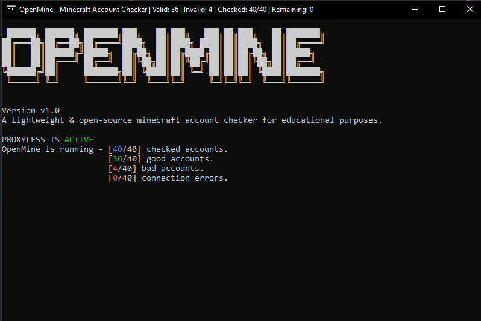

# OpenMine
A lightweight & open-source minecraft account checker that supports Windows, MacOS, and Linux. Built for educational purposes.

### Installation

You will have to have a few things installed before running the checker. This installation guide assumes that you are on a 64bit Windows, MacOS, or Linux system.

First, you will need to install Python. You must use a Python version above `3.0`. 

### Information
OpenMine will check if all the account credentials (email:password) provided are valid or invalid for Minecraft.

OpenMine, a fork of Minecraft Account Checker, implements preliminary support for 
- Checking/using HTTP or HTTPS proxies 
- Saving Minecraft account usernames 
- User-friendly CLI.

### Current issues
- Need a lot of cleanup + more stable CLI updates that don't rely on tick-based updating. 
- Ratelimited proxies will be reused because we can't understand how to properly detect when a proxy is ratelimited by Mojang's API (we'll fix it soon)

### Usage
1. Load your combos inside of 'combo.txt'
2. **(optional)** Load your proxy list inside of 'proxies.txt' 
3. Run python script.py
4. Enter threads
5. Sit back and relax, all valid account credentials will be outputted to Valid.txt

